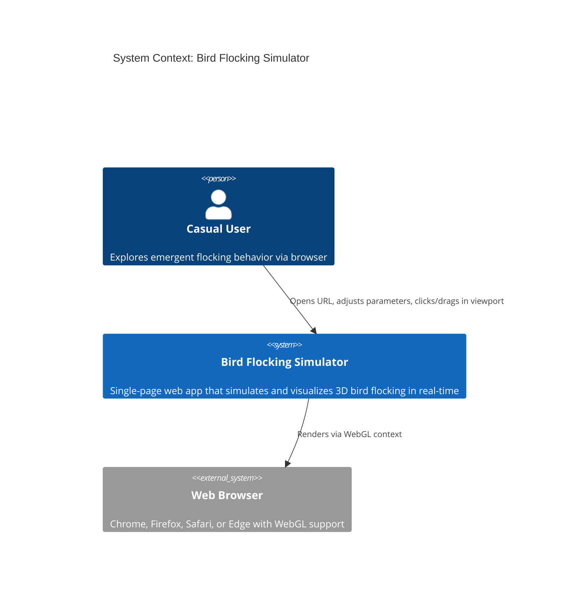
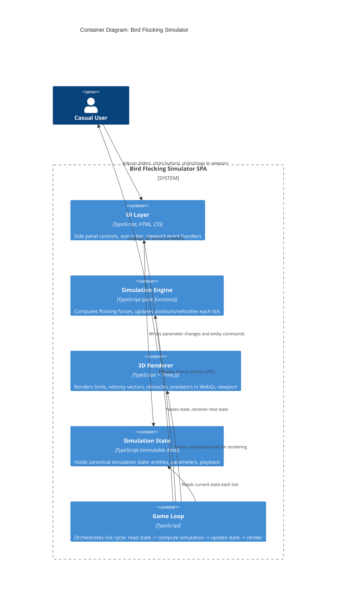
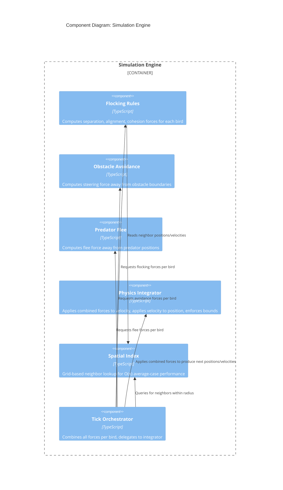

# Architecture Design: Bird Flocking Simulator

## System Context

A single-page web application that simulates 3D bird flocking behavior using Craig Reynolds' Boids algorithm. Users observe emergent flocking patterns and interact via parameter sliders, viewport clicks/drags, and playback controls. No backend services, no authentication, no persistence -- purely client-side.

### Business Capabilities

| Capability | Description |
|---|---|
| Flocking Simulation | Computes bird positions/velocities each frame using separation, alignment, cohesion rules plus obstacle avoidance and predator flee |
| 3D Visualization | Renders birds as points with velocity vector lines in a WebGL-powered 3D viewport |
| Parameter Control | Exposes flocking weights, speed, and entity management through a reactive side panel |
| Viewport Interaction | Translates mouse events (click, drag, orbit, zoom) into simulation commands |
| Status Reporting | Displays live entity counts and FPS |

---

## C4 System Context Diagram (Level 1)



**Note**: No external systems, APIs, databases, or services. The entire application runs client-side in the browser. The browser's WebGL API is the only external dependency.

---

## C4 Container Diagram (Level 2)



### Container Responsibilities

| Container | Responsibility | Testability Strategy |
|---|---|---|
| **Simulation Engine** | Pure functions: given current state + parameters + delta time, return next state. No side effects, no DOM, no WebGL. | Unit tests with deterministic inputs. Core of TDD. |
| **Simulation State** | Immutable data store. Holds birds, predators, obstacles, parameters, playback state. Single source of truth. | Unit tests for state transitions and invariants. |
| **UI Layer** | DOM event handlers, slider/button bindings, viewport mouse event translation (click vs. drag detection, raycasting). | Integration tests with DOM (jsdom/happy-dom). Thin layer. |
| **3D Renderer** | Translates simulation state into Three.js scene graph updates. Manages camera, scene, and WebGL context. | Manual/visual testing only. Kept as thin as possible. |
| **Game Loop** | Orchestrator: requestAnimationFrame loop that reads state, calls simulation engine, writes next state, triggers render. Computes FPS. | Integration test for loop timing. Thin orchestrator. |

---

## C4 Component Diagram (Level 3) -- Simulation Engine

The simulation engine is the most complex subsystem and warrants a component-level diagram.



### Component Responsibilities

| Component | Input | Output | Pure? |
|---|---|---|---|
| **Flocking Rules** | Bird position, neighbor positions/velocities, weights | 3D force vector (separation + alignment + cohesion) | Yes |
| **Obstacle Avoidance** | Bird position/velocity, obstacle positions/radii | 3D avoidance force vector | Yes |
| **Predator Flee** | Bird position, predator positions, flee radius | 3D flee force vector | Yes |
| **Physics Integrator** | Current position, current velocity, combined force, delta time, bounds | Next position, next velocity | Yes |
| **Spatial Index** | All bird positions, query radius | List of neighbor indices | Yes (rebuilt each tick) |
| **Tick Orchestrator** | Full simulation state, parameters, delta time | Next simulation state | Yes |

Every component is a pure function (or set of pure functions). No component holds mutable state. All state lives in the immutable Simulation State container.

---

## Architecture Style

**Modular monolith with dependency inversion (ports-and-adapters).**

Rationale:
- Single developer -- no need for deployment boundaries
- Single-page app -- all code ships as one bundle
- Performance-critical -- function calls are faster than any IPC
- Testability achieved through pure functions and dependency inversion, not service isolation

### Dependency Rule

Dependencies point inward toward the simulation engine (domain core):

```
UI Layer --> State Store <-- Game Loop --> Simulation Engine <-- (nothing)
                                    |
                                    v
                               3D Renderer
```

The simulation engine has ZERO dependencies on UI, rendering, or browser APIs. It operates on plain TypeScript data structures. This is the key architectural invariant.

### Port Definitions

| Port | Direction | Purpose |
|---|---|---|
| `SimulationPort` | Driving (inbound) | Game loop calls simulation engine with current state, receives next state |
| `RenderPort` | Driven (outbound) | Game loop pushes computed state to renderer for visualization |
| `InputPort` | Driving (inbound) | UI layer writes parameter changes and entity commands to state store |
| `MetricsPort` | Driven (outbound) | Game loop pushes FPS and timing data to status bar |

The ports are TypeScript types (not runtime abstractions). The simulation engine accepts and returns plain data. The renderer accepts plain data. No interface injection is needed because the boundary is enforced by data shape, not by runtime polymorphism.

---

## Data Flow per Frame

```
1. requestAnimationFrame fires
2. Game Loop reads current SimulationState from State Store
3. Game Loop calls simulateTick(state, deltaTime) -> nextState
   a. Spatial index built from bird positions
   b. For each bird: compute flocking + avoidance + flee forces
   c. Integrator applies forces -> new positions/velocities
   d. Return new SimulationState (immutable)
4. Game Loop writes nextState to State Store
5. Game Loop calls render(nextState, camera)
6. Game Loop computes FPS, pushes to status bar
```

All state transitions are synchronous within a single frame. No async operations in the hot path.

---

## Testing Strategy

### Layer 1: Simulation Engine (Pure Unit Tests) -- ~80% of test effort

All flocking rules, avoidance, flee, integration, and spatial indexing are pure functions. Tests provide deterministic inputs and assert on outputs. No mocks needed. No DOM. No browser.

Example test shape:
- Given 2 birds at positions A and B with separation weight 1.0
- When simulateTick is called
- Then birds move apart

### Layer 2: State Management (Unit Tests) -- ~10% of test effort

State transitions (add bird, remove bird, update parameter, reset) tested as pure functions on immutable data.

### Layer 3: UI Integration (DOM Tests) -- ~8% of test effort

Slider changes call correct state mutations. Click/drag detection fires correct commands. Status bar reads correct values. Uses jsdom or happy-dom.

### Layer 4: Renderer (Manual/Visual) -- ~2% of test effort

The 3D renderer is a thin adapter. It translates data to Three.js calls. Testing it with automated assertions provides low value because the output is visual. Keep it thin. Verify visually during development.

### TDD Compliance

The architecture is specifically designed to maximize the surface area of pure, testable functions. The simulation engine -- which contains all business logic -- is 100% testable via TDD without any browser, DOM, or WebGL dependency.

---

## Deployment Architecture

```
Single static file deployment:
  index.html
  main.js (bundled TypeScript)
  style.css (optional, minimal)

Served by any static file server or opened directly from filesystem.
No server-side components.
```

Build tool: Vite (see Technology Stack for rationale).

---

## Quality Attribute Strategies

| Quality Attribute | Strategy |
|---|---|
| **Performance (60 FPS / 200 birds)** | Spatial grid reduces neighbor search from O(n^2) to O(n). Simulation engine operates on typed arrays or plain arrays (no allocation per frame). Renderer reuses Three.js objects (no create/destroy per frame). |
| **Responsiveness (next-frame parameter changes)** | Parameters read from state store each tick. No buffering, no debouncing. Slider -> state -> next tick reads it. |
| **Testability (TDD)** | Simulation engine is pure functions on plain data. Zero browser dependencies. 80%+ of logic is testable in Node.js. |
| **Maintainability (incremental delivery)** | Walking skeleton (US-0) proves all architectural boundaries. Each subsequent story adds behavior within established boundaries. No architectural changes needed after US-0. |
| **Browser Compatibility** | Three.js abstracts WebGL differences. Vite produces ES2020+ bundles. No browser-specific APIs beyond standard WebGL and DOM. |

---

## Implementation Roadmap (Story Order)

Per DISCUSS wave recommendation:

| Order | Story | Architectural Validation |
|---|---|---|
| 1 | US-0: Walking Skeleton | Proves all 5 containers work together. All boundaries validated. |
| 2 | US-6: Camera Navigation | Validates renderer camera controls don't conflict with input handling. |
| 3 | US-1: Full Parameters | Validates slider-to-engine path generalizes beyond one slider. |
| 4 | US-8: Status Bar | Validates metrics port and same-frame count updates. |
| 5 | US-2: Bird Management | Validates raycasting input and entity creation commands. |
| 6 | US-3: Obstacles | Validates drag detection and avoidance physics. |
| 7 | US-4: Predators | Validates flee physics as distinct from avoidance. |
| 8 | US-5: Playback Controls | Validates simulation state freeze/resume. |
| 9 | US-7: Reset | Validates full state reset across all containers. |

---

## Risks and Mitigations

| Risk | Likelihood | Impact | Mitigation |
|---|---|---|---|
| 60 FPS not achievable with 200 birds | Medium | High | Spatial grid indexing. Profile early in US-0. Budget: 8ms simulation, 8ms render per frame. |
| Click vs. drag detection unreliable | Low | Medium | Time + distance threshold (e.g., >5px movement OR >200ms hold = drag). Proven pattern. |
| Three.js bundle size excessive | Low | Low | Tree-shaking via Vite. Only import used modules. |
| WebGL not available | Very Low | High | Show fallback message. WebGL is supported in all evergreen browsers. |
